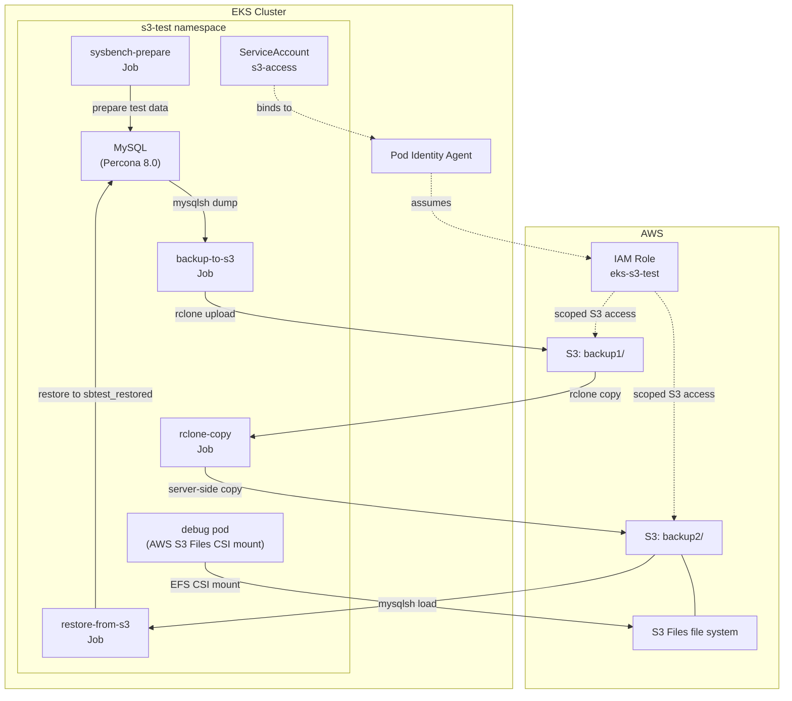

> Demo of EKS Pod Identity with MySQL backup/restore via rclone and an AWS S3 Files CSI debug mount. No credentials stored in the cluster.

## Why Pod Identity?

[EKS Pod Identity](https://docs.aws.amazon.com/eks/latest/userguide/pod-identities.html) lets pods assume IAM roles without storing AWS credentials anywhere in the cluster. The Pod Identity Agent (built into EKS Auto Mode) injects temporary credentials based on the pod's ServiceAccount.

**Benefits**:
- No static credentials to rotate or leak
- Fine-grained access control per ServiceAccount
- Audit trail in CloudTrail

## Prerequisites

- AWS account with SSO configured (copy `.env.example` to `.env` and set `AWS_PROFILE` and `AWS_REGION`)
- EKS cluster created via `just setup-eks`

Terraform pre-creates:
- S3 bucket: `test-<ACCOUNT_ID>`
- IAM role: `eks-s3-test` scoped to the test bucket
- AWS S3 Files file system backed by the test bucket
- EFS CSI driver addon with Pod Identity associations in `kube-system`
- Pod Identity association for the `s3-test` namespace

## Quick Start

```bash
just s3-test      # Full demo: sysbench → backup → copy → debug pod
just s3-restore   # Optional: restore backup to sbtest_restored database
just s3-cleanup   # Remove K8s resources (S3 bucket kept)
```

## Architecture



## What's Here

| File | Purpose |
|------|---------|
| [base/namespace.yaml](https://github.com/wagov-dtt/tutorials-and-workshops/blob/main/s3-pod-identity/base/namespace.yaml) | Namespace and ServiceAccount |
| [base/s3files.yaml](https://github.com/wagov-dtt/tutorials-and-workshops/blob/main/s3-pod-identity/base/s3files.yaml) | Shared rclone env vars and AWS S3 Files StorageClass |
| [base/mysql.yaml](https://github.com/wagov-dtt/tutorials-and-workshops/blob/main/s3-pod-identity/base/mysql.yaml) | MySQL deployment and sysbench data prep |
| [base/debug.yaml](https://github.com/wagov-dtt/tutorials-and-workshops/blob/main/s3-pod-identity/base/debug.yaml) | Debug pod with AWS S3 Files CSI mount |
| [jobs/backup.yaml](https://github.com/wagov-dtt/tutorials-and-workshops/blob/main/s3-pod-identity/jobs/backup.yaml) | mysqlsh dump → S3 backup1/ |
| [jobs/copy.yaml](https://github.com/wagov-dtt/tutorials-and-workshops/blob/main/s3-pod-identity/jobs/copy.yaml) | rclone server-side copy backup1/ → backup2/ |
| [jobs/restore.yaml](https://github.com/wagov-dtt/tutorials-and-workshops/blob/main/s3-pod-identity/jobs/restore.yaml) | S3 backup2/ → mysqlsh load |

## Learning Goals

- **EKS Pod Identity**: How pods assume IAM roles without static credentials
- **mysqlsh for backups**: Using MySQL Shell's `util.dumpSchemas()` and `util.loadDump()`
- **rclone server-side copy**: Copying between S3 prefixes without downloading locally
- **AWS S3 Files CSI mounts**: Mounting S3-backed file systems into pods with the EFS CSI driver for debugging and inspection

## Debugging

### Interactive Cluster UI

```bash
just -c k9s  # Opens k9s with AWS credentials loaded
```

### S3 Bucket Inspection

```bash
just -c 'aws s3 ls s3://test-$(just _account)/'         # List bucket root
just -c 'aws s3 ls s3://test-$(just _account)/backup1/' # List backup contents
```

### Debug Pod

```bash
kubectl exec -it debug -n s3-test -- sh
ls /mnt/s3  # S3 bucket contents via AWS S3 Files / EFS CSI
```

Uses [AWS S3 Files with the Amazon EFS CSI driver](https://docs.aws.amazon.com/AmazonS3/latest/userguide/s3-files-mounting-eks.html) for the filesystem mount. The `rclone/` directory still uses veloxpack rclone CSI for local k3d clusters only.

### CSI Driver Logs

If S3 mounts fail, check the EFS CSI driver logs:

```bash
kubectl logs -n kube-system -l app=efs-csi-controller --tail=50
kubectl logs -n kube-system -l app=efs-csi-node --tail=50
```

Common issue: pods stuck in `ContainerCreating` can indicate a missing S3 Files mount target or NFS/2049 security group rule for the node subnet.

## Key Patterns

- **initContainer + main container**: [backup.yaml](https://github.com/wagov-dtt/tutorials-and-workshops/blob/main/s3-pod-identity/jobs/backup.yaml) uses an initContainer for mysqlsh dump, main container for rclone upload
- **Server-side copy**: [copy.yaml](https://github.com/wagov-dtt/tutorials-and-workshops/blob/main/s3-pod-identity/jobs/copy.yaml) copies between S3 prefixes without downloading locally
- **Schema rename on restore**: [restore.yaml](https://github.com/wagov-dtt/tutorials-and-workshops/blob/main/s3-pod-identity/jobs/restore.yaml) uses `util.loadDump()` with the `schema` option to restore to a different database name
- **Pod Identity auth**: All jobs use `serviceAccountName: s3-access` bound to an IAM role via Terraform's `aws_eks_pod_identity_association`

## See Also

- [LEARNING_PATH.md](../learning-path.md#22-s3-pod-identity) - Step-by-step walkthrough
- [GLOSSARY.md](../glossary.md#pod-identity) - Pod Identity definition
- [rclone/](rclone.md) - rclone CSI examples on local k3d
- [eksauto/](eksauto.md) - EKS cluster configuration and cost info
- [Mounting S3 file systems on Amazon EKS](https://docs.aws.amazon.com/AmazonS3/latest/userguide/s3-files-mounting-eks.html) - Official AWS S3 Files pattern
- [EKS Pod Identity docs](https://docs.aws.amazon.com/eks/latest/userguide/pod-identities.html) - Official AWS documentation
