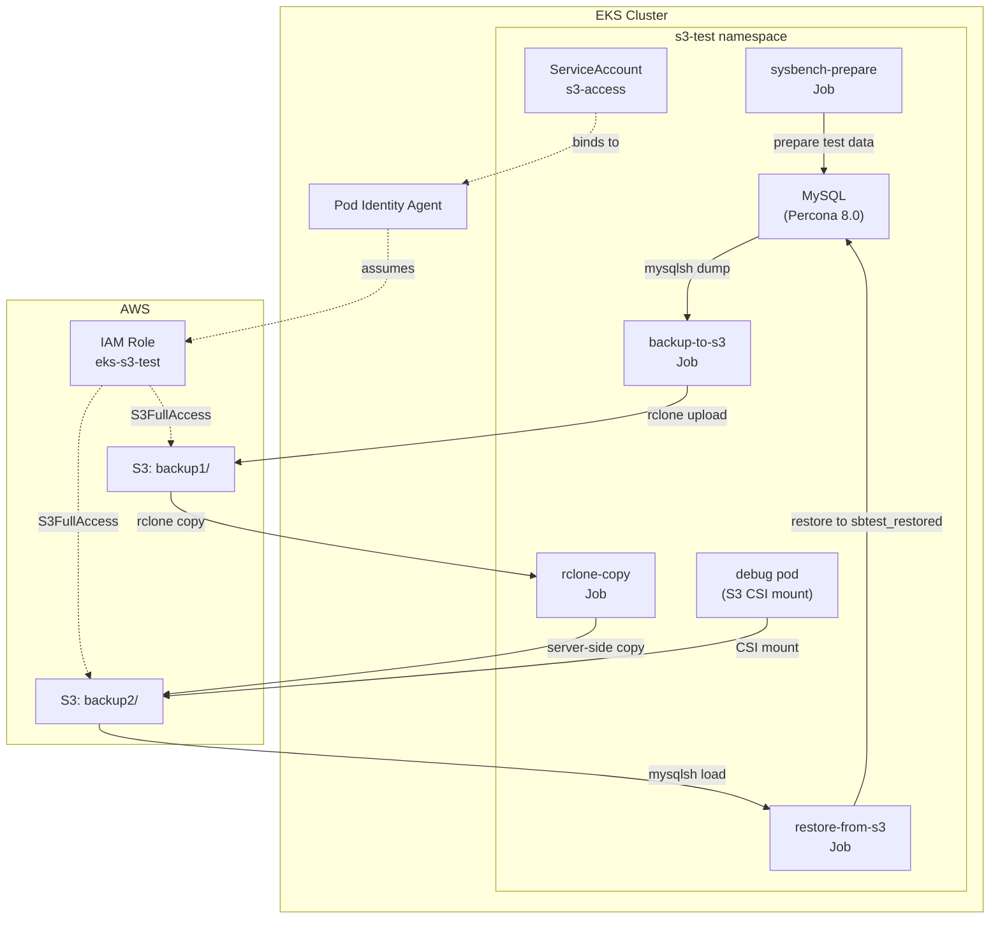

# S3 Pod Identity Example

Demo of [EKS Pod Identity](https://docs.aws.amazon.com/eks/latest/userguide/pod-identities.html) with MySQL backup/restore via rclone. No credentials stored in cluster.

> **Note**: EKS Auto Mode has Pod Identity Agent built-in - no addon required.

## Architecture



## Usage

```bash
just s3-pod-identity-test    # Full demo
just s3-pod-identity-cleanup # Remove resources
```

## Structure

| File | Purpose |
|------|---------|
| [base/namespace.yaml](base/namespace.yaml) | Namespace + ServiceAccount |
| [base/rclone.yaml](base/rclone.yaml) | Shared rclone config (env vars, CSI secret, StorageClass) |
| [base/mysql.yaml](base/mysql.yaml) | MySQL deployment + sysbench data prep |
| [base/debug.yaml](base/debug.yaml) | Debug pod with S3 CSI mount |
| [jobs/backup.yaml](jobs/backup.yaml) | mysqlsh dump → S3 backup1/ |
| [jobs/copy.yaml](jobs/copy.yaml) | rclone server-side copy backup1/ → backup2/ |
| [jobs/restore.yaml](jobs/restore.yaml) | S3 backup2/ → mysqlsh load |

## Debug Pod

```bash
kubectl exec -it debug -n s3-test -- sh
ls /mnt/s3  # S3 bucket contents via rclone CSI
```

Uses [veloxpack rclone CSI driver](https://github.com/veloxpack/csi-driver-rclone) to mount S3 as a filesystem.

## Key Patterns

- **initContainer + main container**: [backup.yaml](jobs/backup.yaml) uses initContainer for mysqlsh dump, main container for rclone upload
- **Server-side copy**: [copy.yaml](jobs/copy.yaml) copies between S3 prefixes without downloading locally
- **Schema rename on restore**: [restore.yaml](jobs/restore.yaml) uses `util.loadDump()` with `schema` option to restore to different DB name
- **Pod Identity auth**: All jobs use `serviceAccountName: s3-access` bound to IAM role via `eksctl create podidentityassociation`
