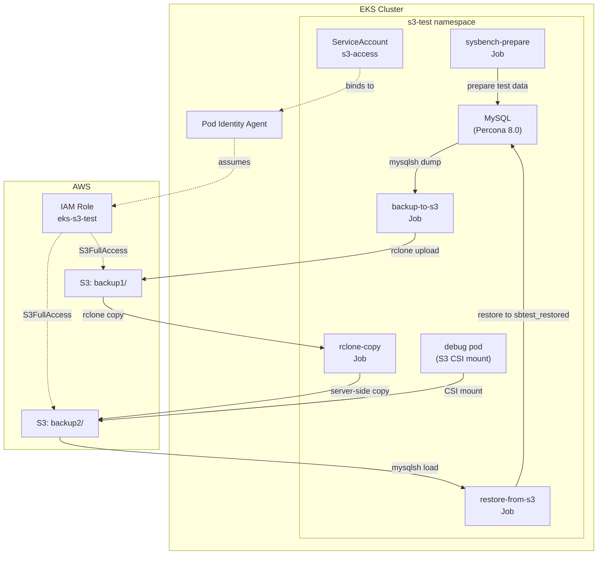

# S3 Pod Identity Example

Demo of [EKS Pod Identity](https://docs.aws.amazon.com/eks/latest/userguide/pod-identities.html) with MySQL backup and rclone CSI mount.

> **Note**: EKS Auto Mode has Pod Identity Agent built-in - no addon installation required.

## Architecture



## Flow

1. Percona MySQL + sysbench creates test data
2. MySQL Shell + rclone backs up to `s3://bucket/backup1/`
3. rclone copies `backup1/` → `backup2/`
4. Debug pod mounts S3 via [veloxpack rclone CSI driver](https://github.com/veloxpack/csi-driver-rclone)

All S3 access uses Pod Identity - no credentials stored in cluster.

## Restore Example

Restore backup to a different database name on the same host:

```bash
just s3-restore  # Restores from backup2/ → sbtest_restored
```

Restores from `backup2/` (the rclone-copied version) to verify the full chain:
`MySQL → mysqlsh dump → S3 backup1/ → rclone copy → S3 backup2/ → restore`

Uses MySQL Shell's `util.loadDump()` with `schema` option to rename during restore.

## Structure

```
kustomize-s3-pod-identity/
├── base/                    # Core resources (applied first)
│   ├── namespace.yaml       # Namespace + ServiceAccount
│   ├── rclone.yaml          # Shared rclone config (env vars, CSI secret, StorageClass)
│   ├── mysql.yaml           # MySQL deployment + sysbench job
│   ├── debug.yaml           # Debug pod with S3 CSI mount
│   └── kustomization.yaml
├── jobs/                    # Applied after MySQL ready
│   ├── backup.yaml          # mysqlsh dump → S3
│   ├── copy.yaml            # S3 backup1/ → backup2/
│   ├── restore.yaml         # S3 → mysqlsh load
│   └── kustomization.yaml
└── kustomization.yaml       # Includes base/
```

## Usage

```bash
just s3-pod-identity-test    # Full demo
just s3-pod-identity-cleanup # Remove resources
```

## Debug pod

```bash
kubectl exec -it debug -n s3-test -- sh
ls /mnt/s3           # S3 bucket contents
```

## Design Pattern: In-Cluster Resource Provisioning

For multi-tenant clusters, infra provisions shared resources once (Aurora cluster, S3 bucket). Apps self-service create databases/prefixes via K8s Jobs - no AWS CLI required.

### Shared Infra (one-time setup by infra team)

```yaml
# Cluster-wide config - Aurora endpoint, shared bucket
apiVersion: v1
kind: ConfigMap
metadata:
  name: shared-infra
  namespace: kube-system
data:
  aurora-host: shared-cluster.cluster-xxx.ap-southeast-2.rds.amazonaws.com
  s3-bucket: shared-data-bucket
  s3-region: ap-southeast-2
```

### App Provisioning Job (creates DB + S3 prefix inside existing resources)

```yaml
apiVersion: batch/v1
kind: Job
metadata:
  name: provision-myapp
  namespace: myapp
spec:
  template:
    spec:
      serviceAccountName: s3-access  # Pod Identity for S3
      restartPolicy: Never
      initContainers:
      # Create MySQL database + user inside Aurora
      - name: create-db
        image: percona:8.0
        command:
        - sh
        - -c
        - |
          mysql -h $AURORA_HOST -u admin -p$ADMIN_PASS <<EOF
          CREATE DATABASE IF NOT EXISTS myapp_db;
          CREATE USER IF NOT EXISTS 'myapp'@'%' IDENTIFIED BY '$APP_PASS';
          GRANT ALL ON myapp_db.* TO 'myapp'@'%';
          EOF
        env:
        - name: AURORA_HOST
          valueFrom:
            configMapKeyRef:
              name: shared-infra
              key: aurora-host
        - name: ADMIN_PASS
          valueFrom:
            secretKeyRef:
              name: aurora-admin
              key: password
        - name: APP_PASS
          valueFrom:
            secretKeyRef:
              name: myapp-db-creds
              key: password
      containers:
      # Create S3 prefix (empty object as marker)
      - name: create-prefix
        image: rclone/rclone:latest
        command:
        - sh
        - -c
        - |
          echo "placeholder" | rclone rcat s3:$BUCKET/myapp/.keep -v
        env:
        - name: BUCKET
          valueFrom:
            configMapKeyRef:
              name: shared-infra
              key: s3-bucket
        - name: RCLONE_CONFIG_S3_TYPE
          value: "s3"
        - name: RCLONE_CONFIG_S3_PROVIDER
          value: "AWS"
        - name: RCLONE_CONFIG_S3_ENV_AUTH
          value: "true"
        - name: RCLONE_CONFIG_S3_REGION
          valueFrom:
            configMapKeyRef:
              name: shared-infra
              key: s3-region
```

### App Cleanup Job

```yaml
apiVersion: batch/v1
kind: Job
metadata:
  name: deprovision-myapp
spec:
  template:
    spec:
      serviceAccountName: s3-access
      restartPolicy: Never
      initContainers:
      - name: drop-db
        image: percona:8.0
        command: ["sh", "-c", "mysql -h $AURORA_HOST -u admin -p$ADMIN_PASS -e 'DROP DATABASE IF EXISTS myapp_db; DROP USER IF EXISTS myapp;'"]
        # ... env vars same as above
      containers:
      - name: delete-prefix
        image: rclone/rclone:latest
        command: ["sh", "-c", "rclone purge s3:$BUCKET/myapp/ -v"]
        # ... env vars same as above
```

### Key Principles

1. **No AWS CLI for app teams** - MySQL Shell/rclone commands inside existing resources
2. **Shared infra ConfigMap** - Apps discover Aurora/S3 endpoints via K8s config
3. **Pod Identity for S3** - No credentials stored, IAM scoped to bucket prefix via policy
4. **Idempotent** - `CREATE IF NOT EXISTS`, `DROP IF EXISTS`
5. **MySQL Shell for backups** - Parallel dumps with `util.dumpInstance()`, zstd compression

### Finalizer Pattern for Automatic Cleanup

Use a ConfigMap with finalizer to trigger cleanup jobs when deleted:

```yaml
apiVersion: v1
kind: ConfigMap
metadata:
  name: myapp-resources
  namespace: myapp
  finalizers:
  - myapp.example.com/cleanup  # Blocks deletion until removed
  annotations:
    cleanup-job: deprovision-myapp  # Job to run on delete
data:
  db-name: myapp_db
  s3-prefix: myapp/
```

A simple controller (or CronJob polling) watches for ConfigMaps with the finalizer in `deletionTimestamp != nil` state:

```yaml
# Controller logic (pseudo):
# 1. Find ConfigMaps with finalizer AND deletionTimestamp set
# 2. Run cleanup Job (mysqlsh DROP DATABASE, rclone purge)
# 3. Wait for Job completion
# 4. Remove finalizer (allows K8s to delete ConfigMap)
apiVersion: batch/v1
kind: Job
metadata:
  name: cleanup-myapp
spec:
  template:
    spec:
      serviceAccountName: s3-access
      restartPolicy: Never
      initContainers:
      - name: drop-db
        image: container-registry.oracle.com/mysql/community-operator:9.2.0-2.2.3
        command:
        - mysqlsh
        - --uri=admin@$AURORA_HOST
        - -e
        - "session.runSql('DROP DATABASE IF EXISTS myapp_db')"
      containers:
      - name: delete-prefix
        image: rclone/rclone:latest
        command: ["sh", "-c", "rclone purge s3:$BUCKET/myapp/ -v"]
```

After cleanup Job succeeds, remove the finalizer:
```bash
kubectl patch configmap myapp-resources -p '{"metadata":{"finalizers":null}}'
```

### Scoping S3 Access per App

IAM policy attached to Pod Identity role can limit prefix access:

```json
{
  "Effect": "Allow",
  "Action": ["s3:*"],
  "Resource": [
    "arn:aws:s3:::shared-data-bucket/myapp/*"
  ]
}
```
