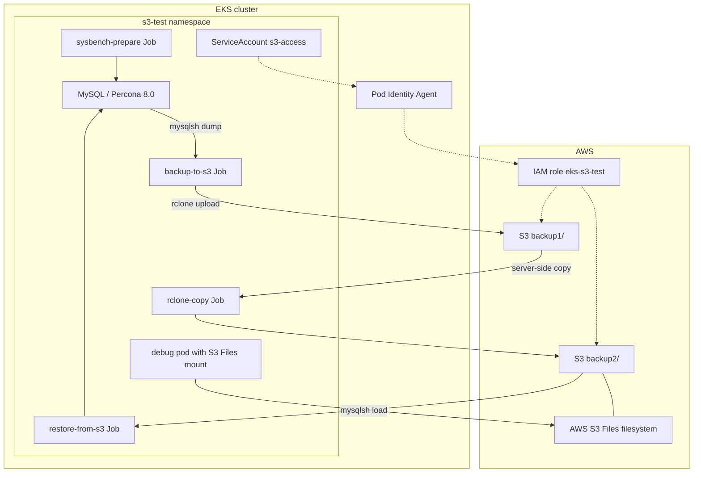

# s3-pod-identity/

EKS lab for Pod Identity, MySQL backup/restore, rclone S3 copy, and AWS S3 Files debug mounts. No static AWS credentials are stored in the cluster.

Run `just aws-preflight` before this lab.

## Why Pod Identity?

[EKS Pod Identity](https://docs.aws.amazon.com/eks/latest/userguide/pod-identities.html) lets pods assume IAM roles through their Kubernetes ServiceAccount. The Pod Identity Agent injects temporary credentials for matching pods.

Benefits:

- No static AWS credentials in Kubernetes Secrets
- IAM scope per ServiceAccount
- CloudTrail audit trail
- Cleaner rotation story than long-lived access keys

## Prerequisites

- AWS profile/SSO configured; copy `.env.example` to `.env` if useful.
- EKS cluster created with `just eksauto/setup-eks`.
- Terraform outputs/resources from `eksauto/terraform`.

Terraform pre-creates:

| Resource | Purpose |
|----------|---------|
| S3 bucket `test-<ACCOUNT_ID>` | Backup and copy target |
| IAM role `eks-s3-test` | Scoped access to the test bucket |
| AWS S3 Files file system | S3-backed filesystem for debug pod mount |
| EFS CSI driver add-on | Mount path for AWS S3 Files |
| Pod Identity association | Binds `s3-test/s3-access` to the IAM role |

## Quick start

```bash
just s3-pod-identity/deploy       # sysbench -> MySQL backup -> S3 copy -> debug mount
just s3-pod-identity/smoke        # Check MySQL, debug pod, and S3 backup prefix
just s3-pod-identity/s3-restore   # Optional restore into sbtest_restored
just s3-pod-identity/clean        # Remove Kubernetes resources; S3 bucket remains
```

## Architecture


```mermaid
flowchart TB
    subgraph EKS["EKS cluster"]
        subgraph NS["s3-test namespace"]
            MySQL["MySQL / Percona 8.0"]
            Sysbench["sysbench-prepare Job"]
            Backup["backup-to-s3 Job"]
            Copy["rclone-copy Job"]
            Restore["restore-from-s3 Job"]
            Debug["debug pod with S3 Files mount"]
            SA["ServiceAccount s3-access"]
        end
        PIA["Pod Identity Agent"]
    end

    subgraph AWS["AWS"]
        IAM["IAM role eks-s3-test"]
        S3B1["S3 backup1/"]
        S3B2["S3 backup2/"]
        S3Files["AWS S3 Files filesystem"]
    end

    Sysbench --> MySQL
    MySQL -->|"mysqlsh dump"| Backup
    Backup -->|"rclone upload"| S3B1
    S3B1 -->|"server-side copy"| Copy
    Copy --> S3B2
    S3B2 -->|"mysqlsh load"| Restore
    Restore --> MySQL
    S3B2 --- S3Files
    Debug --> S3Files
    SA -.-> PIA
    PIA -.-> IAM
    IAM -.-> S3B1
    IAM -.-> S3B2
```

## What to study

| Path | Purpose |
|------|---------|
| `../charts/s3-pod-identity/templates/base/namespace.yaml` | Namespace and ServiceAccount |
| `../charts/s3-pod-identity/templates/base/s3files.yaml` | rclone environment and AWS S3 Files StorageClass |
| `../charts/s3-pod-identity/templates/base/mysql.yaml` | MySQL deployment and sysbench data prep |
| `../charts/s3-pod-identity/templates/base/debug.yaml` | Debug pod with AWS S3 Files CSI mount |
| `../charts/s3-pod-identity/templates/base/networkpolicy.yaml` | EKS-facing network boundary example |
| `../charts/s3-pod-identity/templates/jobs/backup.yaml` | `mysqlsh` dump -> S3 `backup1/` |
| `../charts/s3-pod-identity/templates/jobs/copy.yaml` | rclone server-side copy `backup1/` -> `backup2/` |
| `../charts/s3-pod-identity/templates/jobs/restore.yaml` | S3 `backup2/` -> `mysqlsh` load |
| `../eksauto/terraform/pod_identity.tf` | Pod Identity association |

## Debugging

Interactive cluster UI:

```bash
just -c k9s
```

S3 inspection:

```bash
just -c 'aws s3 ls s3://test-$(just _account)/'
just -c 'aws s3 ls s3://test-$(just _account)/backup1/'
```

Debug pod:

```bash
kubectl exec -it debug -n s3-test -- sh
ls /mnt/s3
```

CSI driver logs:

```bash
kubectl logs -n kube-system -l app=efs-csi-controller --tail=50
kubectl logs -n kube-system -l app=efs-csi-node --tail=50
```

A pod stuck in `ContainerCreating` often means a missing S3 Files mount target or blocked NFS/2049 traffic from the node subnet.

## Key patterns

- `backup.yaml` uses an initContainer for `mysqlsh` dump and a main container for rclone upload.
- `copy.yaml` performs server-side S3 prefix copy without downloading locally.
- `restore.yaml` uses `util.loadDump()` with a schema override to restore into a different database name.
- All jobs use `serviceAccountName: s3-access`, bound to IAM by Terraform's `aws_eks_pod_identity_association`.

## References

- [EKS Pod Identity](https://docs.aws.amazon.com/eks/latest/userguide/pod-identities.html)
- [Mounting S3 file systems on Amazon EKS](https://docs.aws.amazon.com/AmazonS3/latest/userguide/s3-files-mounting-eks.html)
- [MySQL Shell dump and load utilities](https://dev.mysql.com/doc/mysql-shell/8.0/en/mysql-shell-utilities.html)
- [rclone S3 backend](https://rclone.org/s3/)
- [LEARNING_PATH.md](../LEARNING_PATH.md#22-s3-pod-identity)
- [GLOSSARY.md](../GLOSSARY.md#eks-pod-identity)
